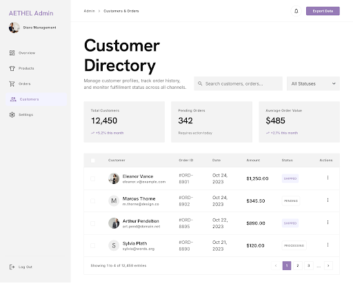
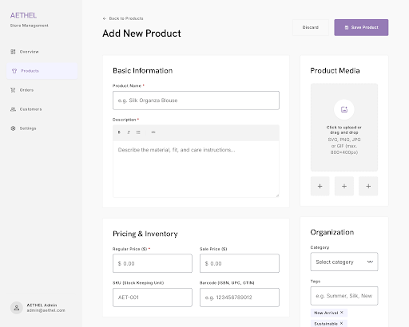
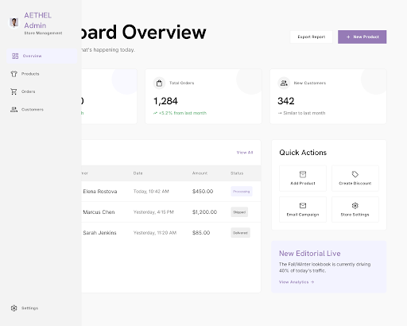
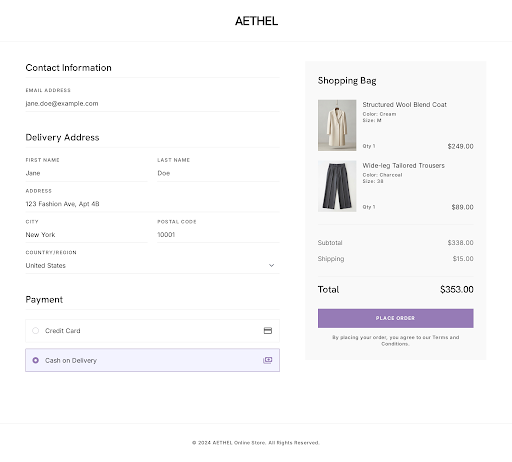
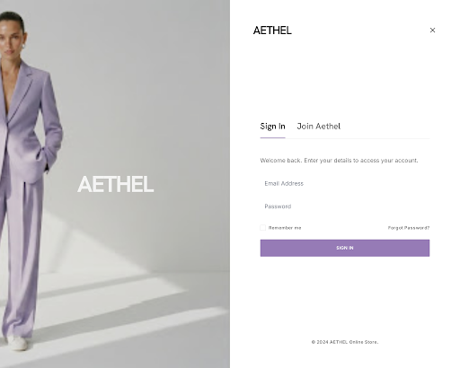
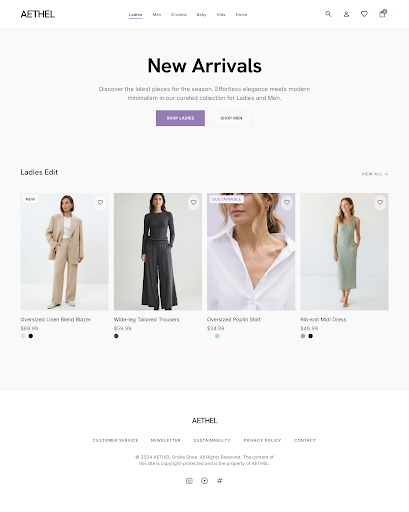
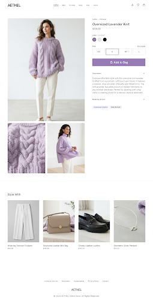

# 🪻 Aethel Lavender Fashion Hub

**Project Title:** Aethel Lavender Fashion Hub  
**Stitch Project ID:** 10969939508210603174  
**GitHub Repository:** [AETHEL-Major-Project-Corizo](https://github.com/nigeshsatheesh/AETHEL-Major-Project-Corizo)

---

## 📌 Project Overview

This repository contains the complete design code and visual screenshots for the **Aethel Lavender Fashion Hub**, downloaded directly using the **Stitch API**.

---

## 🗂️ Downloaded Screens Summary

| # | Screen Name | Screen ID | Code Link | Preview |
|---|---|---|---|---|
| 1 | **Aethel Admin - Orders & Customers** | e2b2fc96f1c847d8b4879495c51d0227 | [HTML Code](./01-admin-orders-customers/index.html) | [Screenshot](./01-admin-orders-customers/screenshot.png) |
| 2 | **Aethel Admin - Add Product** | 6b418cd50a984059b829e838bae75f1c | [HTML Code](./02-admin-add-product/index.html) | [Screenshot](./02-admin-add-product/screenshot.png) |
| 3 | **Aethel Admin - Overview** | 157957aa5ced44a48669f6e2ecbf886f | [HTML Code](./03-admin-overview/index.html) | [Screenshot](./03-admin-overview/screenshot.png) |
| 4 | **Aethel - Checkout & Confirmation** | efac51e898fc4842856bb60d1137cbef | [HTML Code](./04-checkout-confirmation/index.html) | [Screenshot](./04-checkout-confirmation/screenshot.png) |
| 5 | **Aethel - Sign In or Join** | 9d3af3b80494405994ed3c6d88f2fe8f | [HTML Code](./05-sign-in-or-join/index.html) | [Screenshot](./05-sign-in-or-join/screenshot.png) |
| 6 | **Aethel - Shop Modern Fashion** | 205ed935836e4f5691da956fc6384535 | [HTML Code](./06-shop-modern-fashion/index.html) | [Screenshot](./06-shop-modern-fashion/screenshot.png) |
| 7 | **Aethel - Oversized Lavender Knit Sweater** | ca0a42b9d6ce4f54ad173afa4d470a1d | [HTML Code](./07-oversized-lavender-knit-sweater/index.html) | [Screenshot](./07-oversized-lavender-knit-sweater/screenshot.png) |

---

## 🚀 How to Run / View

Open index.html in your web browser or navigate into any screen's directory to inspect the HTML source and UI mockup directly.

`ash
# Clone repository
git clone https://github.com/nigeshsatheesh/AETHEL-Major-Project-Corizo.git

# Navigate into project directory
cd AETHEL-Major-Project-Corizo
`
"@

 = @"
<!DOCTYPE html>
<html lang="en">
<head>
    <meta charset="UTF-8">
    <meta name="viewport" content="width=device-width, initial-scale=1.0">
    <title>Aethel Lavender Fashion Hub - Stitch Showcase</title>
    <link rel="preconnect" href="https://fonts.googleapis.com">
    <link rel="preconnect" href="https://fonts.gstatic.com" crossorigin>
    <link href="https://fonts.googleapis.com/css2?family=Plus+Jakarta+Sans:wght@300;400;500;600;700&display=swap" rel="stylesheet">
    
</head>
<body>

    <header>
        <h1>🪻 Aethel Lavender Fashion Hub</h1>
        
Stitch Project ID: 10969939508210603174 | Downloaded UI Screens & HTML Code

    </header>

    

        

            

                
            

            

                

                    
1. Admin - Orders & Customers

                    
ID: e2b2fc96f1c847d8b4879495c51d0227

                

                

                    <a href="./01-admin-orders-customers/index.html" class="btn btn-primary" target="_blank">View Code</a>
                    <a href="./01-admin-orders-customers/screenshot.png" class="btn btn-secondary" target="_blank">Screenshot</a>
                

            

        

        

            

                
            

            

                

                    
2. Admin - Add Product

                    
ID: 6b418cd50a984059b829e838bae75f1c

                

                

                    <a href="./02-admin-add-product/index.html" class="btn btn-primary" target="_blank">View Code</a>
                    <a href="./02-admin-add-product/screenshot.png" class="btn btn-secondary" target="_blank">Screenshot</a>
                

            

        

        

            

                
            

            

                

                    
3. Admin - Overview

                    
ID: 157957aa5ced44a48669f6e2ecbf886f

                

                

                    <a href="./03-admin-overview/index.html" class="btn btn-primary" target="_blank">View Code</a>
                    <a href="./03-admin-overview/screenshot.png" class="btn btn-secondary" target="_blank">Screenshot</a>
                

            

        

        

            

                
            

            

                

                    
4. Checkout & Confirmation

                    
ID: efac51e898fc4842856bb60d1137cbef

                

                

                    <a href="./04-checkout-confirmation/index.html" class="btn btn-primary" target="_blank">View Code</a>
                    <a href="./04-checkout-confirmation/screenshot.png" class="btn btn-secondary" target="_blank">Screenshot</a>
                

            

        

        

            

                
            

            

                

                    
5. Sign In or Join

                    
ID: 9d3af3b80494405994ed3c6d88f2fe8f

                

                

                    <a href="./05-sign-in-or-join/index.html" class="btn btn-primary" target="_blank">View Code</a>
                    <a href="./05-sign-in-or-join/screenshot.png" class="btn btn-secondary" target="_blank">Screenshot</a>
                

            

        

        

            

                
            

            

                

                    
6. Shop Modern Fashion

                    
ID: 205ed935836e4f5691da956fc6384535

                

                

                    <a href="./06-shop-modern-fashion/index.html" class="btn btn-primary" target="_blank">View Code</a>
                    <a href="./06-shop-modern-fashion/screenshot.png" class="btn btn-secondary" target="_blank">Screenshot</a>
                

            

        

        

            

                
            

            

                

                    
7. Oversized Lavender Knit Sweater

                    
ID: ca0a42b9d6ce4f54ad173afa4d470a1d

                

                

                    <a href="./07-oversized-lavender-knit-sweater/index.html" class="btn btn-primary" target="_blank">View Code</a>
                    <a href="./07-oversized-lavender-knit-sweater/screenshot.png" class="btn btn-secondary" target="_blank">Screenshot</a>
                

            

        

    

    <footer>
        
Project created for Corizo Major Project • Maintained by @nigeshsatheesh

    </footer>

</body>
</html>
